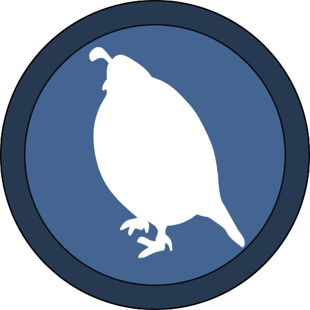

# Rusty Danda vm

## About

This is virtual machine that Rusty danda binary runs on. It does not include compiler or language refferences.

If you want to use RDVM in your project, reffer to the main repository.

## Features
 - [x] registers, stack, heap and string memory
 - [x] homemade garbage collector
 - [x] exceptions system
 - [x] interface to develop libraries in Rust
 - [x] exit codes + interface for debuggers
 - [ ] standard library (io, string, thread, gc) - currently in development
 - [ ] browser support
 
## How to use
VM is located in /runtime/ folder, copy files ``cargo.toml`` and ``lib.rs`` to start developing.

Alternatively you can build dll and use its interface to run RDVM in your project.

If you are interested in developing rust libraries, you do so after you setup cargo project refferencing RDVM
and use its public trait. (more on that in libraries repository which is not public at the moment)

## Instructions
Since instructions change all the time I am not going to write them here, but you can check out the runtime source, where they are documented.
